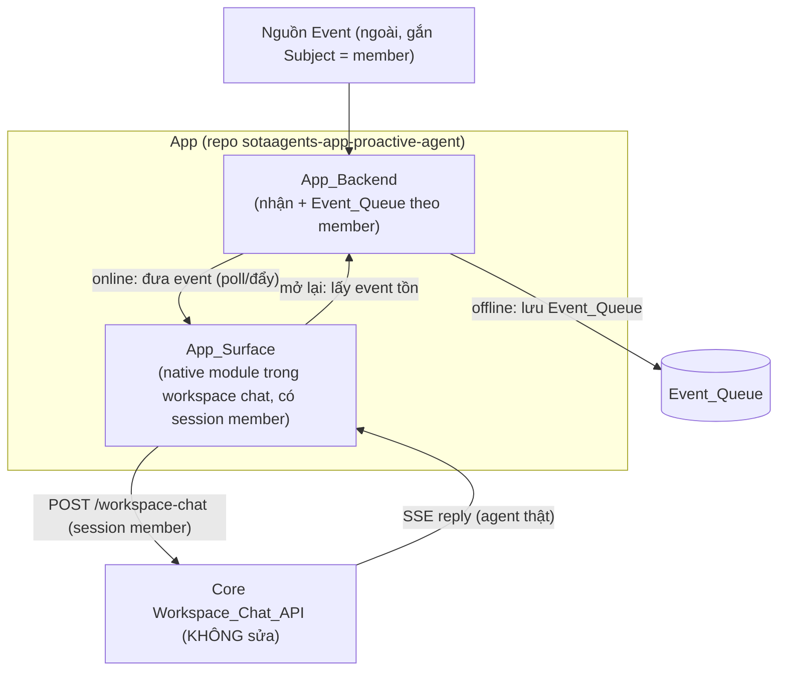

# Design Document — Proactive Event-Driven Agent (App thuần)

## Overview

Feature là một **App SotaAgents độc lập** (repo này), **không sửa Core**. App
tái dùng API chat sẵn có của Core (`POST /workspace-chat`) làm bộ máy hội thoại;
App chỉ lo: nhận Event, lưu hàng đợi khi offline, đưa Event tới giao diện khi
online, và gọi API chat bằng **session của chính member**.

Nguyên tắc chốt:
- **Chỉ code App**, Core giữ nguyên.
- **Session member** là danh tính gọi chat → conversation + credit đúng member.
- **Offline = ghi nhận, không chạy**; member quay lại = xử lý event tồn.

## Architecture

Ranh giới: App backend (nhận/lưu/định tuyến event) + App surface (UI + gọi chat).
Core chỉ là API được gọi.

## Components and Interfaces

### 1. App_Backend — nhận Event + Event_Queue (Req 2, 5, 9)
- Endpoint nhận Event (webhook), xác minh nguồn, đọc Subject (member).
- Trạng thái member Online/Offline (theo App_Surface có đang kết nối không).
- Online → chuyển Event tới Surface (poll hoặc kênh đẩy riêng của App — Req 9).
- Offline → lưu vào `Event_Queue` theo member (không chạy agent — Req 5).
- Đánh dấu đã xử lý để không lặp (Req 6.4).

### 2. App_Surface — UI + gọi chat bằng session member (Req 4, 6, 7, 8)
- Native module đóng góp vào workspace chat (nút mở giao diện App).
- Chạy trong trình duyệt member → **có session Better Auth của member**.
- Khi nhận Event (online) hoặc lấy event tồn (mở lại): nạp Context, gọi
  `POST /workspace-chat` **bằng session member** → nhận SSE → render.
- Hiển thị Conversation duy nhất của member (Req 3, 8).

### 3. Conversation mapping (Req 3)
- conversationId tất định từ định danh member → một hội thoại/member.
- Dùng lại conversation hiện có khi mở app.

### 4. Kiểm soát nhịp (Req 10)
- Gộp event dồn dập → tối đa một lượt/cửa sổ; trần lượt/member; lọc "đáng phản hồi".
- App quyết định loại event đáng phản hồi (cấu hình theo tenant — Req 11).

## Data Models

- **MemberConversationMap**: member → conversationId (tất định).
- **Event_Queue**: theo member, mỗi event có {type, payload, subject, receivedAt,
  status: pending|processed}.
- **PresenceState**: member → online/offline (theo kết nối App_Surface).
- **RateState**: đếm lượt/member trong cửa sổ + trạng thái debounce.

## Correctness Properties

### Property 1: Không sửa Core
Toàn bộ code feature nằm trong repo App; feature chạy được với Core không đổi.

**Validates: Requirements 1**

### Property 2: Credit đúng member
Mọi lượt agent được gọi bằng session của đúng member là Subject của Event; không
dùng service account.

**Validates: Requirements 7**

### Property 3: Offline không tiêu credit
Khi member offline, Event chỉ được ghi vào Event_Queue; không có lượt agent nào
chạy và không credit nào bị trừ.

**Validates: Requirements 5.2**

### Property 4: Event không mất
Mọi Event hợp lệ của member offline đều nằm trong Event_Queue cho tới khi được
xử lý hoặc hết hạn.

**Validates: Requirements 5.1, 5.3**

### Property 5: Không xử lý lại
Một Event đã xử lý được đánh dấu và không tạo thêm lượt agent.

**Validates: Requirements 6.4**

### Property 6: Một hội thoại/member
Mỗi member ánh xạ tới đúng một Conversation, tất định.

**Validates: Requirements 3**

### Property 7: Kiểm soát nhịp
Event dồn dập của một member tạo tối đa một lượt/cửa sổ; event không "đáng phản
hồi" không tạo lượt agent.

**Validates: Requirements 10**

## Error Handling
- Event thiếu Subject → từ chối, không xử lý (Req 2.3).
- Đưa event tới Surface thất bại → giữ pending, thử lại/lần mở sau (Req 9.3).
- Gọi Workspace_Chat_API lỗi → giữ event pending, hiển thị lỗi ở Surface, không
  đánh dấu đã xử lý.

## Testing Strategy
- Unit: định tuyến online/offline; Event_Queue lưu/đánh dấu; conversation mapping
  tất định; kiểm soát nhịp (gộp, trần, lọc).
- Integration: online event → surface → workspace-chat (mock) → render; offline
  event → queue → mở lại → xử lý; không xử lý lại.
- Property: P1–P7.

## Open Questions
- **OQ1 — Đưa Event tới Surface:** poll vs kênh đẩy riêng của App (Req 9). Poll
  đơn giản hơn, đủ cho bản đầu.
- **OQ2 — App_Surface kind:** `page` (workspace.nav) vs `composer-panel` cho
  "nút mở giao diện App".
- **OQ3 — Xác thực endpoint nhận Event của App_Backend:** chữ ký webhook từ nguồn
  ngoài (thuộc App, không thuộc Core).
- **OQ4 — Mặc định kiểm soát nhịp:** cửa sổ gộp, trần lượt/member, danh sách loại
  "đáng phản hồi".
- **OQ5 — Session member từ App_Surface gọi workspace-chat:** xác nhận surface
  gọi được API workspace-chat với cookie/session của member (cùng origin
  workspace) — điểm cần verify khi dựng surface.
