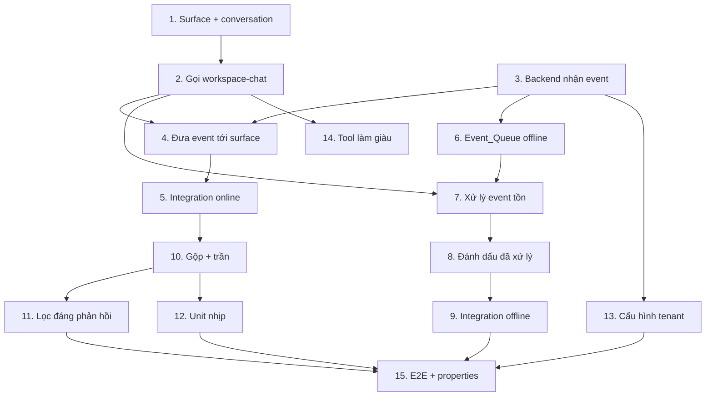

# Implementation Plan — Proactive Event-Driven Agent (App thuần)

## Overview

Toàn bộ task nằm trong repo App này (`sotaagents-app-proactive-agent`). **Không
có task nào sửa Core** — App tái dùng `POST /workspace-chat` sẵn có, gọi bằng
session member. Thứ tự: lát cắt dọc online trước (event → surface → workspace-chat
→ render), rồi offline queue + xử lý khi quay lại, rồi kiểm soát nhịp, rồi
reusability. Mỗi task tham chiếu requirement (Req 1–11) + property liên quan.

## Tasks

### Giai đoạn 1 — Lát cắt dọc online (thin vertical slice)

- [x] 1. App_Surface tối thiểu + hiển thị Conversation của member
  - Native module surface (nút mở giao diện App trong workspace chat).
  - Hiển thị một Conversation duy nhất của member; mapping tất định.
  - _Requirements: 3.1, 3.2, 3.3, 8.1, 8.2_ · _Property 6_

- [x] 2. App_Surface gọi Workspace_Chat_API bằng session member
  - Từ surface, gọi `POST /workspace-chat` bằng session/cookie member; nhận SSE;
    render câu trả lời trong giao diện App. (Verify OQ5: surface gọi được API.)
  - _Requirements: 1.2, 2, 7.1, 7.2, 8.3, 8.4_ · _Property 2_

- [x] 3. App_Backend nhận Event gắn Subject
  - Endpoint nhận Event; xác minh nguồn; đọc Subject (member); từ chối nếu thiếu.
  - _Requirements: 2.1, 2.2, 2.3, 2.4_

- [x] 4. Đưa Event tới Surface khi online (poll — OQ1)
  - App_Backend giữ trạng thái online; Surface poll "có event mới?"; nạp Context
    và gọi workspace-chat (không cần member gõ).
  - _Requirements: 4.1, 4.2, 4.3, 4.4, 9.1, 9.2_

- [x] 5. Integration test lát cắt online
  - event → backend → surface (poll) → workspace-chat (mock/thật) → render.
  - _Requirements: 4.1, 4.2, 4.3, 4.4_

### Giai đoạn 2 — Offline queue & xử lý khi quay lại

- [x] 6. Event_Queue theo member (lưu khi offline)
  - Offline → lưu Event vào queue theo member; KHÔNG chạy agent, KHÔNG tốn credit.
  - _Requirements: 5.1, 5.2, 5.3_ · _Property 3, 4_

- [x] 7. Xử lý Event tồn khi member mở lại
  - Surface mở → lấy event tồn → nạp Context → gọi workspace-chat bằng session member.
  - _Requirements: 6.1, 6.2_

- [x] 8. Đánh dấu đã xử lý + không lặp
  - Đánh dấu event đã xử lý; không tạo lại lượt agent.
  - _Requirements: 6.4_ · _Property 5_

- [x] 9. Integration test offline → quay lại
  - offline event → queue → mở lại → xử lý → đánh dấu; không xử lý lại.
  - _Requirements: 5.1, 5.2, 5.3, 6.1, 6.2, 6.4_

### Giai đoạn 3 — Kiểm soát nhịp

- [x] 10. Gộp event dồn dập + trần lượt/member
  - Gộp event trong cửa sổ → tối đa một lượt; trần lượt/member/cửa sổ; áp cho cả
    online lẫn xử lý event tồn (Req 6.3).
  - _Requirements: 6.3, 10.1, 10.2_ · _Property 7_

- [x] 11. Lọc loại Event "đáng phản hồi"
  - Chỉ chạy lượt agent cho loại event cấu hình; loại khác chỉ ghi nhận.
  - _Requirements: 10.3, 10.4_

- [x] 12. Unit test kiểm soát nhịp
  - Gộp/trần/lọc; conversation mapping tất định.
  - _Requirements: 10.1, 10.2, 10.3, 10.4_

### Giai đoạn 4 — Reusability & hoàn thiện

- [x] 13. Cấu hình theo tenant (loại event đáng phản hồi + nghiệp vụ payload)
  - App diễn giải payload theo nghiệp vụ khách; cấu hình danh sách event theo tenant.
  - _Requirements: 11.1, 11.2, 11.3_

- [x] 14. Tool làm giàu Context (tùy chọn)
  - Tool để agent gọi làm giàu dữ liệu trong lúc chạy (nếu cần).
  - _Requirements: 11.3_

- [x] 15. E2E + kiểm chứng properties
  - E2E: online + offline; xác nhận Property 1–7; không sửa Core.
  - _Requirements: 1.1, 1.2, 1.3_

## Task Dependency Graph

```json
{
  "waves": [
    { "wave": 1, "tasks": ["1", "3"] },
    { "wave": 2, "tasks": ["2", "6"] },
    { "wave": 3, "tasks": ["4", "7"] },
    { "wave": 4, "tasks": ["5", "8"] },
    { "wave": 5, "tasks": ["9", "10", "11"] },
    { "wave": 6, "tasks": ["12", "13", "14"] },
    { "wave": 7, "tasks": ["15"] }
  ]
}
```



## Notes

- **Chỉ một repo:** mọi task trong repo App này. Core KHÔNG sửa.
- **Session member:** surface gọi workspace-chat bằng session member → credit đúng
  người (Property 2). Không service account.
- **Offline:** chỉ ghi nhận, không chạy/không tốn credit (Property 3); xử lý khi
  quay lại.
- **Open Questions giải khi code:** OQ1 (poll — task 4), OQ2 (surface kind — task 1),
  OQ3 (xác thực endpoint event — task 3), OQ4 (mặc định nhịp — task 10), OQ5
  (surface gọi được workspace-chat — task 2).
- Chỉ task code; không deploy/marketing.
